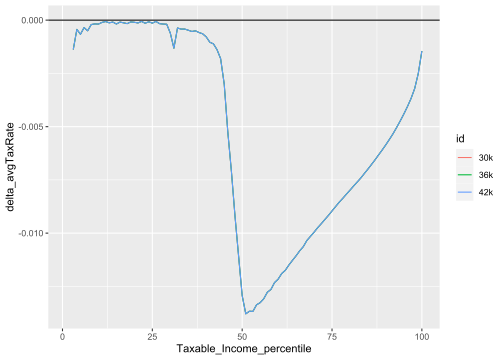

[](https://codecov.io/github/HughParsonage/grattan?branch=master)
[](https://travis-ci.org/HughParsonage/grattan)

grattan
=======

> Important temporary notice (2019-02-09): The vignettes do not run on
> pandoc v2.4 (or take a very long time). Please upgrade to v2.6
> (2019-01-30) if building vignettes. You may need to modify the PATH or
> change the RSTUDIO\_PANDOC env. var after installing.

Australian Tax Policy Analysis

Overview
========

``` r
install.packages("grattan")
```

``` r
library(grattan)
```

    ## Last change: sysdata.rda at 2019-02-09 16:11:51 (2 mins ago).

`income_tax`
------------

Calculates the income tax for a given taxable income and financial year:

``` r
income_tax(50e3, "2015-16")
```

    ## [1] 8547

### With sample files

`income_tax` is designed to work well with the ATO’s sample files. You
can obtain the sample files from my repo:

``` r
# install.packages("taxstats", repos = "https://hughparsonage.github.io/tax-drat")
library(taxstats)

library(hutils)
library(data.table) 
library(magrittr)
library(ggplot2)
```

Simply pass the sample file to `.dots.ATO` and the complexities of
things like Medicare levy and the Seniors and Pensioners Tax Offset are
handled for you. For example:

``` r
s1314 <- as.data.table(sample_file_1314)
s1314 %>%
  .[, tax := income_tax(Taxable_Income, "2013-14", .dots.ATO = s1314)] %>%
  .[, .(Taxable_Income, tax)]
```

    ##         Taxable_Income       tax
    ##      1:           4800     0.000
    ##      2:         126122 36503.970
    ##      3:          39742  4655.410
    ##      4:         108123 29574.355
    ##      5:          85957 21040.445
    ##     ---                         
    ## 258770:          24462  1111.710
    ## 258771:          37055  3701.525
    ## 258772:          45024  6530.520
    ## 258773:           5134     0.000
    ## 258774:          46368  7007.640

`model_income_tax`: modelling changes to personal income tax
------------------------------------------------------------

While `income_tax` is designed to inflexibly return the tax payable as
legislated, `model_income_tax` is designed to calculate income tax when
changes are made. For example,

``` r
s1314 %>%
  # reduce top threshold from 180,000 to 150,000
  model_income_tax(ordinary_tax_thresholds = c(0, 18200, 37000, 80000, 
                                               150e3), 
                   baseline_fy = "2013-14") %>%
  .[, .(Taxable_Income, baseline_tax, new_tax)]
```

    ##         Taxable_Income baseline_tax   new_tax
    ##      1:           4800            0     0.000
    ##      2:         126122        36503 36503.970
    ##      3:          39742         4655  4655.410
    ##      4:         108123        29574 29574.355
    ##      5:          85957        21040 21040.445
    ##     ---                                      
    ## 258770:          24462         1111  1111.710
    ## 258771:          37055         3701  3701.525
    ## 258772:          45024         6530  6530.520
    ## 258773:           5134            0     0.000
    ## 258774:          46368         7007  7007.640

`project`
---------

Given a sample file, we can project forward a number of years

``` r
s1617 <- project(s1314, h = 3L)
```

or to a particular financial year

``` r
s1718 <- project_to(s1314, "2017-18")
```

Together with `model_income_tax`, this allows us to make
point-predictions of future years. The function `revenue_foregone`
prettily prints the resultant revenue:

``` r
sample_file_1314 %>%
  project_to("2018-19") %>%
  model_income_tax(baseline_fy = "2017-18",
                   ordinary_tax_thresholds = c(0, 18200, 37000, 87000, 
                                               150e3)) %>%
  revenue_foregone
```

    ## [1] "$1.8 billion"

### `compare_avg_tax_rates`:

Create comparison of average tax rates:

``` r
lapply(list("30k" = 30e3,
            "36k" = 36e3,
            "42k" = 42e3),
       function(T2) {
         model_income_tax(s1718,
                          baseline_fy = "2017-18",
                          ordinary_tax_thresholds = c(0, 
                                                      18200,
                                                      T2,
                                                      87000, 
                                                      180e3))
       }) %>%
  rbindlist(idcol = "id",
            use.names = TRUE,
            fill = TRUE) %>%
  compare_avg_tax_rates(baseDT = .[id %ein% "36k"]) %>%
  ggplot(aes(x = Taxable_Income_percentile,
             y = delta_avgTaxRate,
             color = id,
             group = id)) +
  geom_hline(yintercept = 0) +
  geom_line()
```



Access ABS data
---------------

NEWS
====

1.7.1.0
-------

### Bug fixes

-   `income_tax` now gives consistent results modulo the existence of
    completely empty columns that are inputs for `sapto` (\#158)

### New functions:

-   `awote` for weekly earnings

### Enhancements:

-   `age_grouper` can now have a custom first label prefix, and is much
    faster when `length(age)` is large.
-   `income_tax` now emits a warning when both age and `.dots.ATO` are
    provided, indicating that `age` will be ignored.
-   The data has been updated to 2019-02-09.

### Internal

-   `mutate_ntile` and `weighted_ntile` now use the `hutils`
    equivalents. This broke 3 unit tests because of the specific
    phrasing of some error messages.
-   The vignette requires pandoc &gt; 2.4. Some chunks have been
    refactored to avoid excess memory usage.

1.7.0.0
-------

### Bug fixes

-   Fixed failing interaction between temporary budget repair levy and
    small business tax offset in 2016-17.
-   `small_business_tax_offset()` is now always positive, fixing the
    original misinterpretation of the legislation whereby negative
    business income resulted in a negative offset.
-   `*_inflator` functions now return correct results for non-standard
    but supported financial years.
-   `inflator` no longer fails when `to_fy` is length &gt; 1 and
    unordered.

### New features

-   `mutate_ntile` and `mutate_weighted_ntile` for adding quantile
    columns
-   New welfare functions (usable for the 2015-16 financial year)
    -   `age_pension`,
    -   `carer_payment`
    -   `carers_allowance`
    -   `energy_supplement`
    -   `family_tax_benefit`
    -   `newstart_allowance`
    -   `pension_supplement`
    -   `rent_assistance` the Commonwealth Rent Assistance
    -   `model_rent_assistance` as experimental function for modelling
        changes to rent assistance.
    -   `youth_allowance()` now available, though limited
-   `compare_avg_tax_rates`: create a difference in average tax rates
    between multiple models and a baseline tax, by percentile.
-   `install_taxstats()` as a convenient means to install the non-CRAN
    `taxstats` dependency.

### Enhancements

-   `prohibit_vector_recycling()` and friends return more informative
    error messages.
-   Added default values to the following functions:
    -   `income_tax`, `income_tax_sapto`: the default value for fy.year
        is the current financial year
    -   `cpi_inflator`, `lf_inflator_fy`, `wage_inflator`: if both
        from\_fy and to\_fy are missing, the default values become the
        previous and current financial years respectively. If only one
        of the two are missing, an error appears.
-   `income_tax` is about twice as fast since 1.6.0.0: 1.5-2.0s down
    from 3.0-3.7s on the 100% population (13 million)
-   `inflator` and `cpi_inflator`, `lf_inflator_fy`, and `wage_inflator`
    are now much faster when either `from_fy` or `to_fy` have more than
    100,000 elements:

``` r
set.seed(19952010)
from_fys <- sample(yr2fy(1995:2010), size = 1e6, replace = TRUE)
microbenchmark(cpi_inflator(from_fy = from_fys, to_fy = "2015-16"))
# Old
Unit: seconds
                                                expr      min      lq     mean   median       uq
 cpi_inflator(from_fy = from_fys, to_fy = "2015-16") 1.519483 1.54438 1.550628 1.549735 1.554507
      max neval
 1.661502   100
 
# New
Unit: milliseconds
                                                expr      min       lq     mean   median       uq
 cpi_inflator(from_fy = from_fys, to_fy = "2015-16") 40.71753 41.94061 47.93162 42.93946 48.08461
      max neval
 191.3497   100
```

### Potentially breaking changes

-   `yr2fy(x)` no longer works for x = 1900L, despite a unit test, for
    the sake of performance.

<!-- -->

      #> Last change: NAMESPACE at 2018-08-19 14:47:14 (4 mins ago).
      #> Unit: milliseconds
      #>       expr min  lq mean median  uq max neval cld
      #>   yr2fy(z)  75  88   98     90 101 161   100  a 
      #>  .yr2fy(z) 274 286  298    297 302 359   100   b

Use `yr2fy(x, assume1901_2100 = FALSE)` if you need the old behaviour.

### Misc/Internal

-   `taxstats1516` is now a suggested dependency.

1.6.0.0
-------

### 2018-05-08

-   Never-legislated Medicare levy change in 2019-20 has been reverted
-   Budget 2018:
    -   `model_income_tax()` no longer coerces `WEIGHT` to integer.
    -   New arguments to support Budget 2018:
        -   `lito_multi` Permits multiple pieces to the linear offset.
        -   `Budget2018_lamington` The Low And Middle Income Tax Offset
            proposed in the Budget 2018 budget.
        -   `Budget2018_lito_202223` The proposed change to LITO from
            2022-23.
        -   `Budget2018_watr` The offset proposed by the Opposition the
            Budget Reply.
        -   `sbto_discount` Allows modification of the small business
            tax offset.
        -   `clear_tax_cols` By default, old tax columns are deleted.
        -   `warn_upper_thresholds` If changed to `FALSE` allows the
            automatic changes to be applied without warning.
-   New functions:
    -   `progressivity()` for Gini-based measure of the progressivity of
        income tax
    -   `revenue_foregone()` as a convenenience for returning the
        revenue foregone from a modelled sample file.
-   Routine changes:
    -   ABS data updated as of 2018-05-21.

1.5.3.6
-------

### 2018-02-21

-   Labour force data and wage price index updated to 2018-02-21.
-   Update as requested to fix failing unit tests relying on
    non-standard packages.

1.5.3.1
-------

### 2018-01-22

### New features:

-   New function `model_income_tax` which attempts to provide every
    lever of the income tax system that is visible from the tax office’s
    sample files. Users can model the sample file by changing single
    parameters to observe the effect on tax collections.
-   `small_business_tax_offset`: Include the small business tax offset
    as a standalone function and within `income_tax`.

### Other user-visible changes

-   `project` and `project_to` no longer require
    `fy.year.of.sample.file`. However, they expect the supplied
    `data.frame` to be compatible with the sample file provided.
    Failling to provide a sample file with the expected number of rows
    or not providing a sample file with a valid number of rows is a
    warning, which can be silenced by `check_fy_sample_file = FALSE`.

### Data:

-   Update labour force data to November 2017
-   Internal projection tables have been updated for the latest
    (2014-15) sample file.

### Other changes

-   `mgcv` was used but not declared in Suggests: Thanks to BDR for
    reporting.
-   (internal) Extend `prohibit_vector_recycling` to return the maximum
    permissible length of a list of vectors.

1.5.2.5
-------

### 2017-11-16

-   Update wage data to 2017-Q3
-   Update labour force data to 2017-09
-   (internal) The `lf_trend` internal data table used to report the
    labour force in thousands of persons, as the ABS does. This seemed a
    bit strange, so now `obsValue` uses integers (i.e. just the labour
    force).
-   Vignettes now install `taxstats` to a temporary directory if not
    already installed, rather than the user or system’s library.

### 2017-10-27

-   Update CPI data
-   Fix wage data

1.5.2.3
-------

### 2017-10-21

-   Update labour-force data

1.5.2.0
-------

### 2017-10-19

-   New internal C++ functions for `income_tax`, and related functions
-   BTO function now uses tax scales from the *Income Tax Regulations*

1.5.1.2
-------

### 2017-10-15

-   Optional argument `age` in `income_tax` now `NULL` rather than
    `42`.  
    The default argument continues to result in SAPTO being not applied
    if `.dots.ATO`. However, if `.dots.ATO` is supplied (and the age
    variable has not been removed from it), the individuals’ SAPTO
    eligibility is determined by the age variable in `.dots.ATO`, rather
    than setting each individual’s SAPTO to 0.

### 2017-08-30

-   Update labour force data. Avoid segfault in separate package in unit
    test.
-   Added a `NEWS.md` file to track changes to the package.

### 2017-08-16

-   Update wage, CPI, labour force data

### 2017-07-02

-   Update wage and labour force data
-   Fix breaking build due to change in dplyr API

CRAN Notes
==========

Test results
------------

0 ERRORS \| 0 WARNINGS \| 1-2 NOTEs

### Test environments:

-   Local Windows CRAN 3.5.1
-   Travis-CI: Ubuntu 14.04. R 3.4, 3.5, and dev (r75443)
-   Appveyor: dev (r75439) and release.
-   winbuilder: dev (r75434) and release.

NOTES:

Possibly mis-spelled words in DESCRIPTION: … ==&gt; Spellings are
correct: ‘repos’ and ‘taxstats’ cannot be quoted as they are within R
code.

URLs in angle brackets: ==&gt; Not appropriate since the URL is within R
code.

Suggests or Enhances not in mainstream repositories: … ==&gt; Normal due
to taxstats dependency

Note to CRAN: moderately-large vignette
---------------------------------------

The vignette is quite lengthy and, while it will run on CRAN, requires
the installation of ‘taxstats’, a 58 MB source package, each time the
package is checked.
